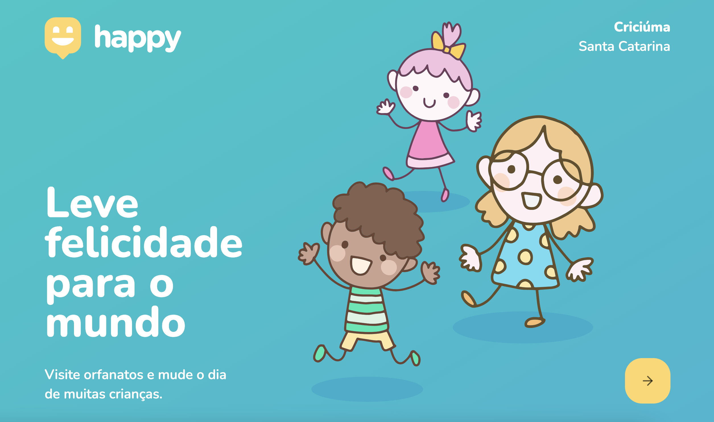

  

  
  <h1 align="center">Next Level Week - "Happy"</h1>

  <a href="#-about">About</a>&nbsp;&nbsp;&nbsp;|&nbsp;&nbsp;&nbsp;
  <a href="#-technologies">Tech</a>&nbsp;&nbsp;&nbsp;|&nbsp;&nbsp;&nbsp;

 ## 📌 About
 Happy was a project developed during next level week, inspired by charity the main goal of this project is to make easier to find orphanages to visit children. In this project i learned about backend architecture in node with TypeORM and sqlite. Also learned about front end with hooks and a map component.

 ## 🛠 Technologies
Frontend developed with React.js and TypeScript.
- **[React.js](https://reactjs.org/)**
- **[TypeScript](https://www.typescriptlang.org/)**
- *[Styled-Components](https://styled-components.com/)*
- *[Axios](https://nodemon.io/)*

Backend developed with NodeJS and Typescript
- **[Node.js](https://nodejs.org/en/)**
- **[Express](https://expressjs.com/pt-br/)**
- *[SQLite](https://www.sqlite.org/index.html)*
- *[TypeORM](https://typeorm.io/)*
